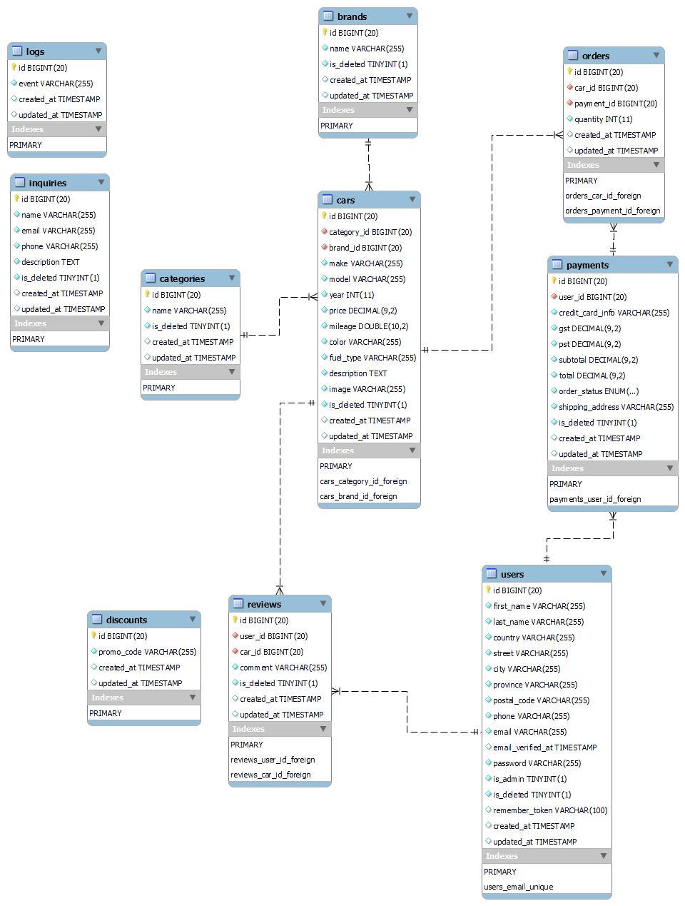

# Project Proposal

## Black Clover ##

**From:** Team 1

**To:** Steve George

**Date:** 21 July 2023

## 1. Description ##
The Black Clover Website  project aims to elevate the online car dealership experience by revamping Black Clover's current website into a cutting-edge platform. As the leading car dealership company specializing in selling cars online, Black Clover seeks to enhance its market position and provide customers with an immersive and user-friendly interface.

## 2. Target audiences ##
The Black Clover Website Transformation project aims to cater to a diverse target audience, encompassing a wide range of potential car buyers. The primary focus will be on tech-savvy consumers who prefer the convenience and ease of shopping for cars online. The following are the key segments of the target audience:

\* Digital Natives: This segment consists of millennials and Gen Z individuals who are highly tech-savvy and accustomed to conducting most of their activities online. They value seamless user experiences and expect to find all the necessary information about cars at their fingertips.

 \* Working Professionals: Busy professionals who have limited time to visit physical showrooms will find the virtual showroom feature particularly appealing. The website's user-friendly interface and streamlined navigation will cater to their need for efficiency and convenience.

\* Remote Shoppers: People residing in remote or distant locations may face challenges in physically visiting car dealerships. The Black Clover website will offer them a convenient alternative, enabling them to explore and purchase cars from anywhere with an internet connection.

\* First-Time Car Buyers: Young adults or individuals purchasing their first cars will appreciate the user-friendly design and comprehensive information available on the website. The virtual showroom will allow them to explore various car models and make informed decisions.

## 3. Project Detail ##
The Black Clover Website Transformation project will involve the development of a dynamic and feature-rich online car dealership platform. This provides a brief overview of the type of features and functionality that the project will include:

### Intuitive User Interface: ###

The website will boast an intuitive and user-friendly interface that enhances the overall customer experience. Easy navigation and a clean layout will guide users seamlessly through the site, ensuring that they can find relevant information effortlessly.

### Comprehensive Car Listings: ###
The website will feature a comprehensive listing of available cars, ranging from new models to pre-owned vehicles. Each car listing will include detailed specifications, high-quality images, pricing, and real-time availability.

### Advanced Search and Filtering: ###
To facilitate a tailored car shopping experience, advanced search and filtering options will be incorporated. Customers can refine their search based on make, model, year, price range, features, and more, enabling them to find their ideal car quickly.

### Secure Online Purchasing: ###
The project will focus on implementing robust security measures to protect customer data during online transactions. Secure payment gateways will be integrated to ensure safe and reliable online purchases.

### User Accounts and Saved Preferences: ###
Customers will have the option to create user accounts, allowing them to save their preferences, track past searches, and receive personalized recommendations based on their browsing history.

## 4. Proposed Design Solution ##
](images/1.jpg)

](images/2.jpg)

](images/3.jpg)

](images/4.jpg)

## 5. User Personas/Use Case statements ##
1. Guest: The Guest user is an unauthenticated visitor with no  account on the e-commerce site. They can browse product categories, view product details, apply basic filters, add items to their cart, proceed to checkout, and complete a purchase without creating an account. They cannot access personalized features like order history or saved preferences.
  
Use Case Statement: As a Guest user, I can explore products, add items to my cart, and make a purchase without needing to create an account. However, I won't have access to personalized features available to registered users. My main goal is to have a smooth and hassle-free shopping experience during my visit.
](images/woman_avatar.jpg) 
Guest

2. Authenticated User: The Authenticated User is a registered customer who has logged into the e-commerce site. They enjoy personalized features, such as tailored product recommendations, saved favorites, and access to order history. They can manage their account settings, utilize faster checkout, and engage in customer support services.
  
Use Case Statement: As an Authenticated User, I can access personalized features like product recommendations and order history. I have the convenience of faster checkout and the ability to manage my account settings. Additionally, I can engage with customer support and participate in loyalty programs for a more tailored shopping experience. 
](images/man_avatar.jpg) 
Authenticated User

3. Customer Service Representative (CSR): The CSR is responsible for assisting customers with inquiries and issues on the e-commerce site. They have access to customer information, can handle order updates, process returns/refunds, and provide product details. Their goal is to provide excellent support and ensure customer satisfaction.  
Use Case Statement: As a Customer Service Representative (CSR), my primary use case is to provide exceptional support to customers on the e-commerce site. I can access customer information, handle order updates, process returns/refunds, and provide product details. I respond to customer inquiries, address concerns, and ensure prompt resolution of issues. My goal is to deliver a positive and satisfying shopping experience for every customer I interact with.
](images/woman1.jpg) 
CSR

4. Admin: The Admin is a privileged user with extensive control over the e-commerce site. They manage products, user accounts, website content, orders, and site settings. They monitor inventory, handle customer support escalations, and ensure site security.
  
Use Case Statement: As an Admin, I have full control over the e-commerce site. I can manage products, users, orders, and website content. I monitor inventory, handle customer support escalations, and ensure site security for a smooth and secure shopping experience. 
](images/admin.jpg) 
Admin User

## 6. Sitemaps

### Front end: ###

### Back end: ###

## 7. Server
* We are using Apache on AWS EC2 Server and MySql server for our database.
* Our proposed tech stack for this project includes using PHP Laravel for the backend and HTML, CSS, Bootstrap, Jquery or JavaScript for the front-end.
* The web application will be hosted on AWS EC2 server at cars.uwpace.ca url.
* Other library/package that we have intalled on server:
zip/unzip, php-mbstring php-xml php-zip php-mysql php-sqlite3 php-gd php-zip php-curl

## 8. Security
### On the Server
* We will ensure that all software and dependencies are up to date with latest security patches.
* Firewall rules are set to close all ports except 80,443 and 22.
* We will use secure communication protocols such as HTTPS and SSH to prevent interception of sensitive data by attackers.
* We will regularly monitor the server logs for any suspicious activity.
* We will create application specific user for database access.
* Disabling PHP script on image upload folder.

### In The Web App
* We will validate and filter user input and sanitize when displaying output to prevent SQL injection and XSS attack.
* We will implement proper exception handling to prevent displaying of sensitive information to attackers.
* We will implement RBAC (Role Based Access Control) to ensure that users only have access to data and functionality they need
* We will implement strong password rules for users.

* We will implement CSRF protection. It is essential to safeguard our users from malicious attacks that could compromise their accounts and sensitive data.

## 9. Database
* The database for this project include a user table, cars table, categories table which includes cars categories and a brand tables for car brands.

* There are few other table which includes orders and payments table for handling orders and payments.
* There is a inquiries table for any user inquiries.
* Logs table is used to monitor logs.

### ERD

## 10. Value Adds ##
Welcome to our enhanced ecommerce platform, where we go above and beyond to provide you with an exceptional online shopping experience. In addition to the fundamental ecommerce and administrative functionalities, we are thrilled to introduce a range of value adds that aim to elevate your journey on our website.

* Authentic User Reviews and Ratings: Make informed decisions with the help of genuine user reviews and ratings, fostering a trustworthy community of shoppers.

* Irresistible Promo Code Discounts: Enjoy exclusive discounts with our promo codes, providing you with incredible savings on your favorite products. Keep an eye out for limited-time offers and seasonal promotions to maximize your shopping value.

* Explore Related Products: Discover more exciting products with our related products feature, adding more variety to your shopping experience.

At Black Clover, we are dedicated to enhancing your online shopping journey with these value adds. Embrace the convenience, personalization, and innovation that awaits you, and let our platform redefine the way you shop online.

## 11. Revised ERD for Value Adds ##
1. Authentic User Reviews: The Users table contains information about registered users who can leave reviews.
The Reviews table stores individual review submitted by users for specific products. Each review is linked to a particular user (user_id) and product (product_id).
The Products table remains unchanged and contains information about the products offered.

2. Irresistible Promo Code Discounts: The Discount table contains information about the available promo codes, including the code itself (code) and the discount amount (discount_amount). User can use the Promo Code for discounts during their purchase.
The Products table remains unchanged and contains information about the products offered.

## 12. Our Team

We have an extremely skilled team working day in-out to meet your requirements and deliver quality work. Here is the list of our team members that will be working on the Development of the website:

| Name            | Role                             | Experience |
|-----------------|----------------------------------|------------|
| John Mmaka      | Project Manager & Git            | 10 Years   |
| Hoang Dung Le   | Frontend Designer                | 5 Years    |
| Sudip Bajgai    | Server & Database Administrator  | 7 Years    |
| Vrushik Sangani | Backend Developer                | 10 Years   |

## Team Members' Responsibilities

- **John Mmaka:** He is responsible for managing the entire project, delegating the tasks to the team, and also making sure to get all the deliverables finished before the deadline bug-free along with maintaining the GIT (version control).

- **Hoang Dung Le:** He is responsible for designing the front end of the website, including HTML.

- **Sudip Bajgai:** He is responsible for managing the database. He is also administering the server with all the configurations.

- **Vrushik Sangani:** He is responsible for the PHP Laravel programming of the website. In other words, he will be managing the backend of the website.

